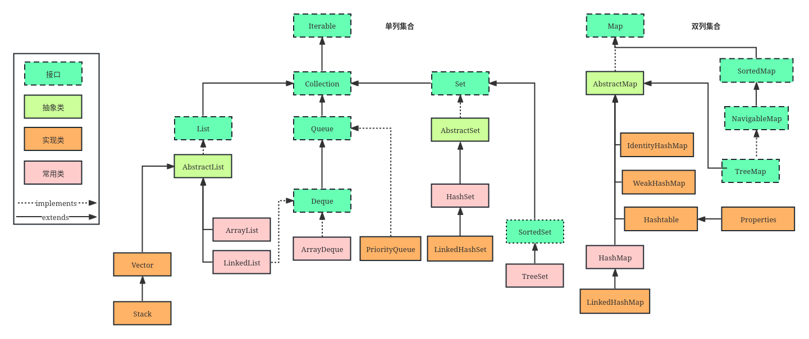

[TOC]

# 单列集合 Collection
## 列表 List
### ArrayList 数组列表
ArrayList是最常用的List实现类，内部是通过数组实现的，它允许对元素进行快速随机访问。数组的缺点是每个元素之间不能有间隔，当数组大小不满足时需要增加存储能力，就要讲已经有数组的数据复制到新的存储空间中。当从ArrayList的中间位置插入或者删除元素时，需要对数组进行复制、移动、代价比较高。因此，它适合随机查找和遍历，不适合插入和删除。

特性：
+ 排列有序可重复
+ 底层使用数组
+ 查询速度快，增删慢，getter和setter快
+ 现场不安全
+ 容量不够时，ArrayList扩容是当前n乘1.5+1

### Vector 数组列表 
Vector与ArrayList一样，也是通过数组实现的，不同的是它支持线程的同步，即某一时刻只有一个线程能够写Vector，避免多线程同时写而引起的不一致性，但实现同步需要很高的花费，因此，访问它比访问ArrayList慢。

特性：
+ 排列有序可重复
+ 底层使用数组
+ 查询速度快，增删慢
+ 线程安全效率低
+ 容量不够默认扩大一倍

### LinkedList 链表
LinkedList是用链表结构存储数据的，很适合数据的动态插入和删除，随机访问和遍历速度比较慢。另外，他还提供了List接口中没有定义的方法，专门用于操作表头和表尾元素，可以当作堆栈、队列和双向队列使用。

特性：
+ 排列有序可重复
+ 底层使用双向循环链表
+ 查询慢增删快
+ 线程不安全

## 集合 Set
### HashSet 哈希表
### TreeSet 红黑树
### LinkedHashSet 
### Queue

# 双列集合
## Map 集合
### Hashtable 哈希表
#### Properties
### HashMap 哈希表
#### LinkedHashMap 基于链表哈希表
### TreeMap 红黑树

## ArrayList、Vector、LinkedList 线性表对比
如果查找一个指定位置的数据，Vector 和 ArrayList 使用的时间是相同的，都是O(1)，这个时候使用 Vector 和 ArrayList 都可以。

如果移动一个指定位置的数据花费的时间为O(n-i)n为总长度，这个时候就应该考虑到使用Linkedlist,因为它移动一个指定位置的数据
所花费的时间为0(1),而查询一个指定位置的数据时花费的时间为O(i)。

ArrayList 和 Vector 是采用数组方式存储数据，此数组元素数大于实际存储的数据以便增加和插入元素，都允许直接序号索引元素，但是插入数据要设计到数组元素移动等内存操作，所以索引数据快插入数据慢，Vector由于使用了synchronized方法（线程安全）所以性能上比ArrayList要差，LinkedList使用双向链表实现存储，按序号索引数据需要进行向前或向后遍历，但是插入数据时只需要记录本项的前后项即可，所以插入数度较快！

# 双列集合

# 族系
两大类型：
1. Collection
    1. List
    2. Set
    3. Queue
2. Map

# Set
+ HashSet
底层数据结构是哈希表。(无序,唯一)
如何来保证元素唯一性?
依赖两个方法：hashCode()和equals()
+ LinkedHashSet
底层数据结构是链表和哈希表。(FIFO插入有序,唯一)
1.由链表保证元素有序
2.由哈希表保证元素唯一
+ TreeSet
底层数据结构是红黑树。(唯一，有序)
1.如何保证元素排序的呢?
自然排序
比较器排序
2.如何保证元素唯一性的呢?
根据比较的返回值是否是0来决定

# List
+ ArrayList
优点: 底层数据结构是数组，查询快，增删慢。
缺点: 线程不安全，效率高
+ Vector
优点: 底层数据结构是数组，查询快，增删慢。
缺点: 线程安全，效率低
+ LinkedList
优点: 底层数据结构是链表，查询慢，增删快。
缺点: 线程不安全，效率高

# Map
+ Hashtable
+ LinkedHashMap
+ HashMap
+ TreeMap

# Set选择
唯一：
要排序：TreeSet或者LinkedHashSet
否：HashSet

# List选择
查询多：ArrayList
增删多：LinkedList

# Map选择
TreeMap是有序的，HashMap和HashTable是无序的
Hashtable的方法是同步的，HashMap的方法不是同步的。这是两者最主要的区别

Hashtable是线程安全的，HashMap不是线程安全的。
HashMap效率较高，Hashtable效率较低。
如果对同步性或与遗留代码的兼容性没有任何要求，建议使用HashMap。 查看Hashtable的源代码就可以发现，除构造函数外，Hashtable的所有 public 方法声明中都有 synchronized关键字，而HashMap的源码中则没有。
Hashtable不允许null值，HashMap允许null值（key和value都允许）
父类不同：Hashtable的父类是Dictionary，HashMap的父类是AbstractMap
