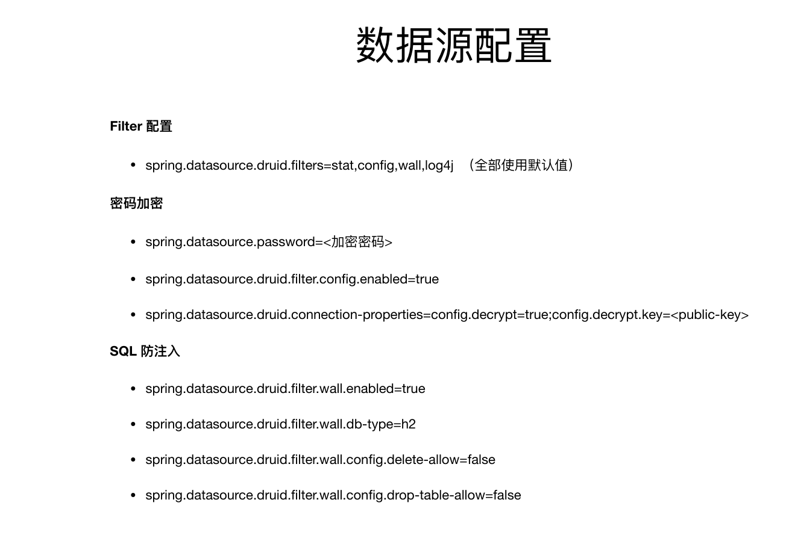
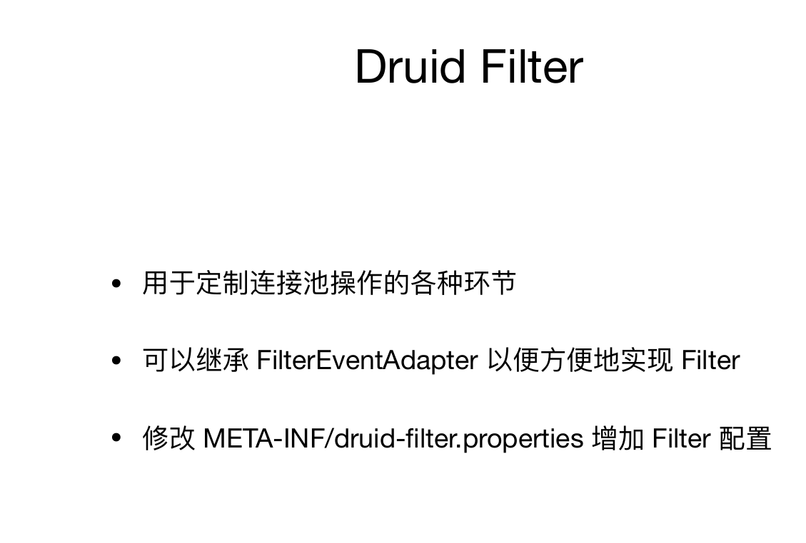

[TOC]

# Spring Boot 2.x
+ 默认使用HikariCP
+ 配置spring.datasource.hikari.*配置

# Spring Boot 1.x
+ 默认使用Tomcat连接池，需要移除tomcat-jdbc依赖
+ spring.datasource.type=com.zaxxer.hikari.HikariDataSOurce

# Druid
监控
filter

druid数据库密码加密