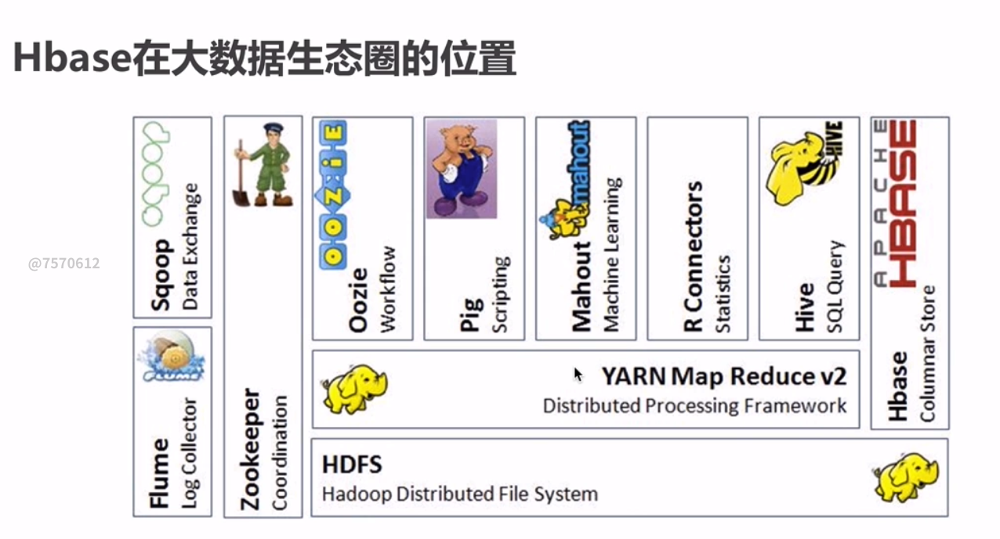
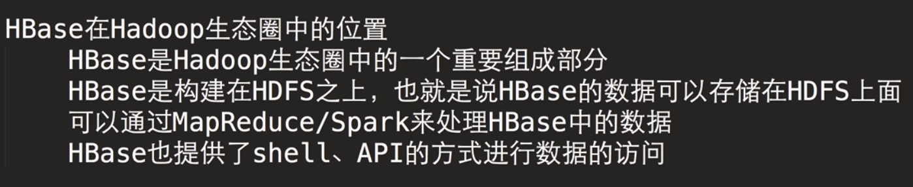
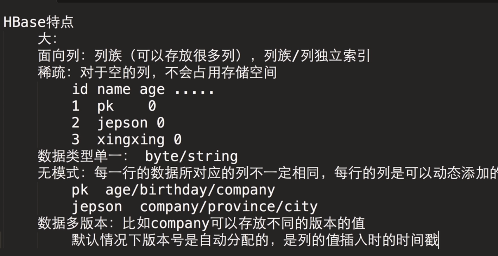
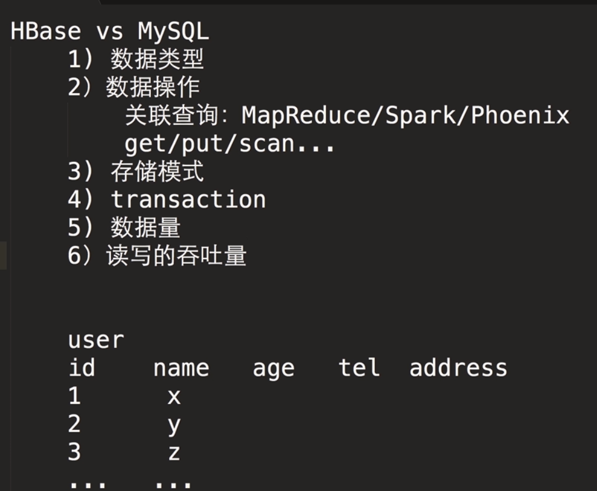
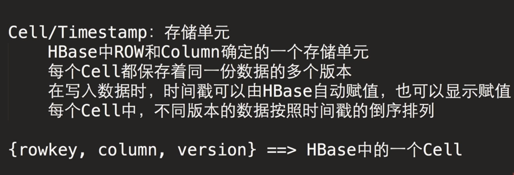

[TOC]

hdfs能存，但是没法进行实时查询，hdfs对随机的读写并不能很好的支持

hdfs：存储数据文件
yarn：
hbase：数据可存储在hdfs
hive：sql化
R：统计分析
pig：脚本语言
Oozie：工作流
Zookeeper：
Flume：日志采集
Sqoop：数据交换

---

hbase列式存储

列式：每一列的数据类型是一样的，可以更好的压缩
压缩、并行处理

---

Hbase vs RDBMS vs HDFS

hbase优势：
1.成熟
2.高效
3.分布式

---
hbase 数据模型
rowkey主键，字符串，按字典顺序存储，在hbase内部保持的是字节数组
列族：Column Family cf，是在创建表的时候要指定的，列族是一系列列的集合，一个列族所有列有着相同的前缀

每条记录被划分到若干个CF中，每条记录对应一个rowkey，每个CF由一个或者多个Column构成

Cell/Timestamp：存储单元

---
hbase环境搭建

https://archive.cloudera.com/cdh5/cdh/5/hbase-1.2.0-cdh5.15.1/