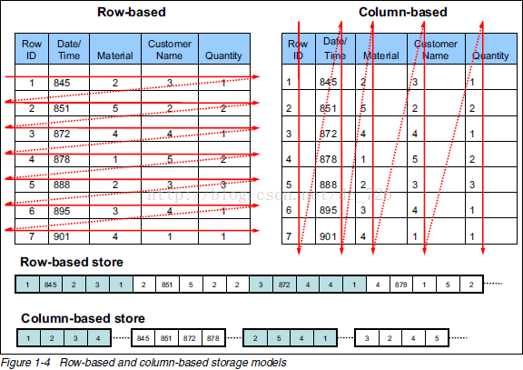
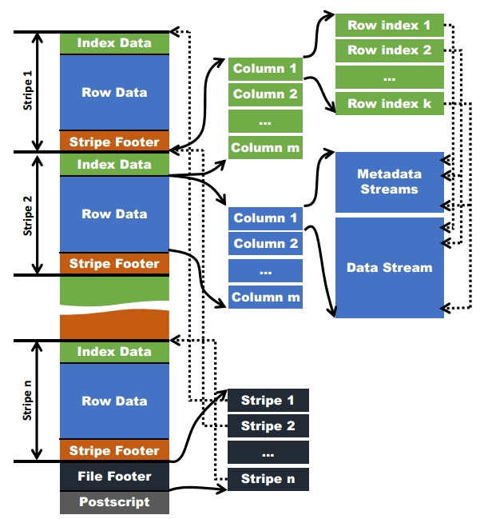

[TOC]

# hive存储格式
|              |         优点         |       缺点       |
| ------------ | -------------------- | ---------------- |
| TextFile     | 简单、方便查看        | 不支持分片        |
| SequenceFile | 可压缩、可分割        | 需要合并、不易查看 |
| OrcFile      | 分片、按列查询、速度快 | 不易查看          |

# 行存储，列存储

|     |                       行式存储                        |                                  列式存储                                  |
| --- | ---------------------------------------------------- | ------------------------------------------------------------------------- |
| 优点 | 数据被保存在一起 insert/update容易                 | 查询时只有涉及到的列会被读取 投影（projection）很高效 任何列都能作为索引 |
| 缺点 | 选择（selection）时即使只涉及某几列，所有数据也都会被读取 | 选择完成时，被选择的列要重新组装 insert/update比较麻烦                     |

传统行式数据库
+ 数据市按行存储的
+ 没有索引的查询使用大量I/O
+ 建立索引和物化视图需要花费大量时间和资源
+ 面对查询的需求，数据库必须被大量膨胀才能满足性能要求

列式数据库
+ 数据按列存储，每一列单独存放
+ 数据即是索引
+ 只访问查询涉及的列：大量降低系统IO
+ 每一列由一个线索来处理：查询的并发处理
+ 数据类型一致，数据特征相似：高效压缩

列式存储优点
+ 查询时只需要读取查询所涉及的列，降低IO消耗，同时保存每一列统计信息，实现部分谓词下推
+ 每列数据类型一致，可针对不同的数据类型采用其高效的压缩算法
+ 列式存储格式假设数据不会发生变化，支持分片、流式读取，更好的适应分布式文件存储的特性

# Orc vs Parquet
+ OrcFile和Parquet都是Apache的顶级项目
+ Parquet不支持ACID、不支持更新，Orc支持有限的ACID和更新
+ Parquet的压缩能力较高，Orc的查询效率较高

# OrcFile

和Parquet类似，ORC文件也是以二进制方式存储的，所以是不可以直接读取，ORC文件也是自解析的，它包含许多的元数据，这些元数据都是同构ProtoBuffer进行序列化的。ORC的文件结构如下图，其中涉及到如下的概念：
+ ORC文件：保存在文件系统上的普通二进制文件，一个ORC文件中可以包含多个stripe，每一个stripe包含多条记录，这些记录按照列进行独立存储，对应到Parquet中的row group的概念。
+ 文件级元数据：包括文件的描述信息PostScript、文件meta信息（包括整个文件的统计信息）、所有stripe的信息和文件schema信息。
+ stripe：一组行形成一个stripe，每次读取文件是以行组为单位的，一般为HDFS的块大小，保存了每一列的索引和数据。
+ stripe元数据：保存stripe的位置、每一个列的在该stripe的统计信息以及所有的stream类型和位置。
+ row group：索引的最小单位，一个stripe中包含多个row group，默认为10000个值组成。
+ stream：一个stream表示文件中一段有效的数据，包括索引和数据两类。索引stream保存每一个row group的位置和统计信息，数据stream包括多种类型的数据，具体需要哪几种是由该列类型和编码方式决定。

