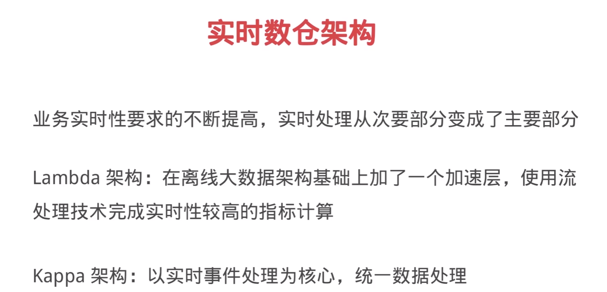

[TOC]

# 离线数仓
+ 离线数据仓库主要基于Hive等技术来构建T+1的离线数据
+ 通过定时任务每天拉取增量数据导入到Hive表中
+ 创建各个业务相关的主题维度数据，对外提供T+1的数据查询

# 离线数仓架构
+ 数据源通过离线的方式导入到离线数仓中
+ 数据分层架构：ODS、DWD、DM
+ 下游应用根据业务需求选择直接读取DM

# 实时数仓
+ 实时数仓基于数据采集工具，将原始数据写入到kafka等数据通道
+ 数据最终写入到类似于HBase这样支持快速读写的存储系统
+ 对外提供分钟级别、甚至秒级别的查询方案

# 离线数仓VS实时数仓
| 数仓类型 |  准确性  |    实时性     |         稳定性         |
| ------- | ------- | ------------ | --------------------- |
| 离线数仓 | 准确度高 | 时延一般在一天 | 稳定性好，方便重算      |
| 实时数仓 | 准确度低 | 分钟级延迟     | 稳定性差，需考虑数据回溯 |

# 实时数仓架构
+ 业务实时性要求的不断提高，实时处理从次要部分变成了主要部分
+ Lambda架构：在离线大数据架构基础上加了一个加速层，使用流处理完成实时性较高的指标计算
+ Kappa架构：以实时事件处理为核心，统一数据处理
