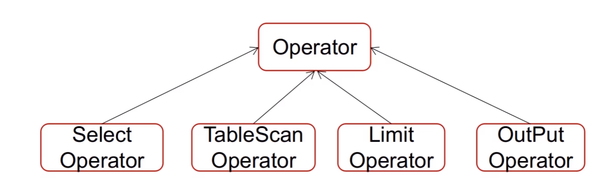
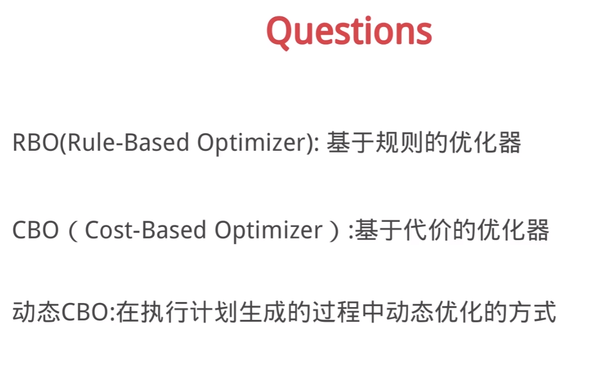

[TOC]

# 执行计划
```
explain select * from test where id > 10 limit 1000
```



hive是基于CBO进行优化的


hive的表存储模型有哪些，谈谈分区分桶表的作用？

什么是数据倾斜，如何解决数据倾斜？
key分布不均匀，业务数据本身的特性
建表时考虑不周，sql语句本身就有数据倾斜
参数调节：hive.map.aggr、hive.groupby.skewindata
调整sql语句：join方式、空值、大小表join

hive小文件合并