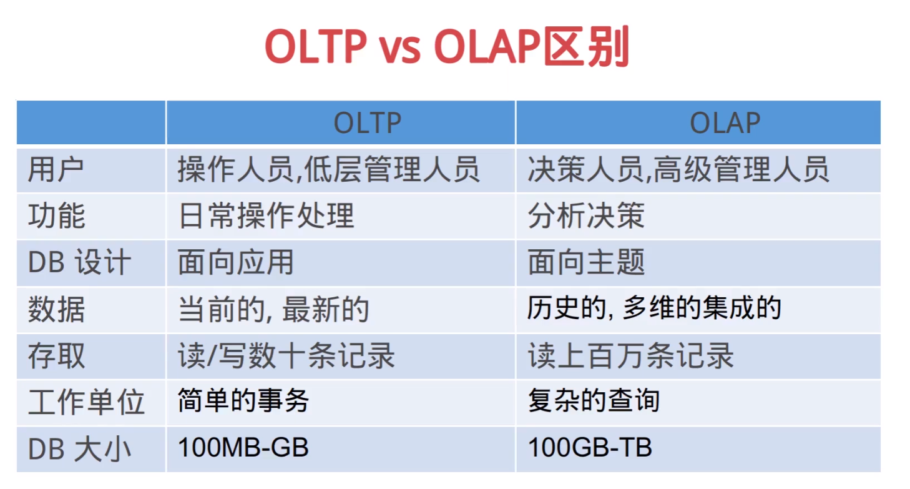
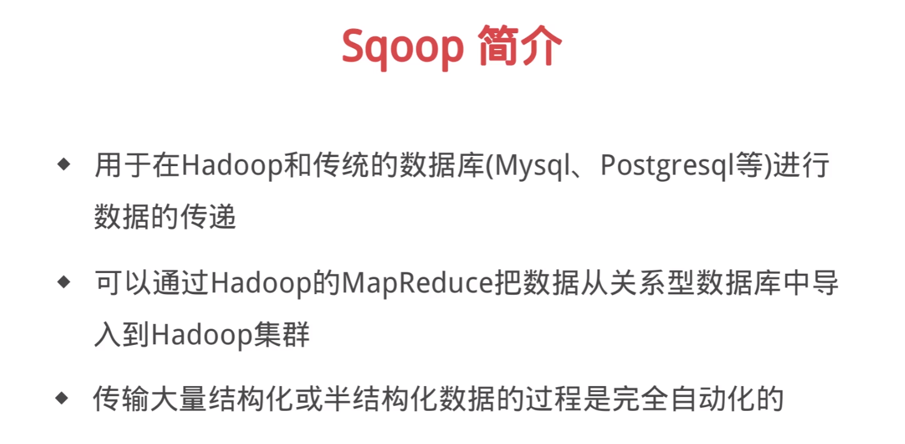
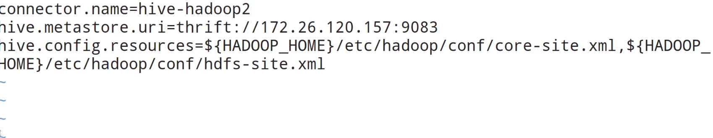
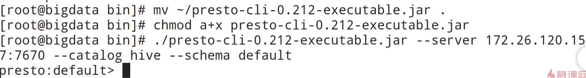

[toc]

# SQL on Hadoop
impala
presto
drill
spark sql
hawq


数据仓库是将多个数据源的数据经过ETL处理之后，按照一定的主题集成起来提供决策支持和联机分析应用的结构化数据环境

主题性
集成性
不可更新性


# Hive简介
+ Hive是基于Hadoop的数据仓库工具，提供类SQL语法
+ Hive是将数据映射成数据库和一张张的表，库和表的元数据信息一般存在关系型数据库
+ 以MR作为计算引擎、HDFS作为存储系统，提供超大数据集的计算/拓展能力

Hive数据存储：Hive的数据是存储在HDFS上的，Hive的库和表是对HDFS上数据的映射
Hive元数据存储：元数据存储一般在外部关系库（Mysql），与Presto Impala等共享

OLTP vs OLAP
联机事务处理OLTP是传统的关系型数据库的主要应用，主要是基本的、日常的事务处理，例如银行交易
联机分析处理OLAP是数据仓库系统的主要应用，支持复杂的分析操作，侧重决策支持，并且提供直观易懂的查询结果






# presto是什么
+ presto是由Facebook开发的分布式SQL查询引擎，用来进行高速、实时的数据分析
+ presto的产生是为了解决Hive的MapReduce模型太慢切不能通过BI等工具展现HDFS数据的问题
+ presto是一个计算引擎，它不存储数据，通过丰富的Connector获取第三方服务的数据，并支持扩展

# presto显而易见的优点
+ presto支持标准的sql，降低了分析人员和开发人员的使用门槛
+ Presto支持可插拔的Connector，可以连接多种数据源。包括Hive、RDBMS、Kafka、MongoDB等等
+ Presto是一个低延时、高并发的内存计算引擎，比Hive执行效率高的多

# presto数据模型
+ Catalog：即数据源。Hive、Mysql都是数据源。presto可以连接多个Hive和多个MySql
+ Schema：类比于DataBase，一个Catalog下有多个Schema
+ Table：数据表，与我们常用的数据库表意义相同，一个Schema下有多个数据表

```sql
select * from hive.testdb.tableA a join mysql.testdb.tableB b where a.id = b.id

show catalogs

show schemas
```

# preseto安装部署

[download](https://prestodb.io/download.html)

presto-server
presto-cli

解压 mkdir etc

两个主要的配置
vim config.properties
```
coordinator=true    #true:coordinator节点，false:worker节点
node-scheduler.include-coordinator=true    #设置该coordinator节点是否参与计算
http-server.http.port=7670
query.max-memory=5GB    #所有节点单查询最大可用内存
query.max-memory-per=1GB    #单节点单查询内存
discovery-server.enabled=true
discover.user=http://xxx.xxx.xxx.xxx:7670
```

vim node.properties
```
node.environment=production
node.id=node01
node.data-dir=/data/presto    #presto存储数据目录
```

JVM配置
jvm.config
```
-server
-Xmx6G
-XX:+UseG1GC
-XX:G1HeapRegionSize=32M
-XX:+UseGCOverheadLimit
-XX:+ExplicitGCInvokesConcurrent
-XX:+HeapDumpOnOutOfMemoryError
+XX:+ExitOnOutOfMemoryError
```

vim log.properties
```
com.facebook.presto=INFO
```

mkdir catalog
cd catalog
将hive添加到presto
vim hive.properties


启动
cd ../../bin
./launcher start

---
客户端 cli

