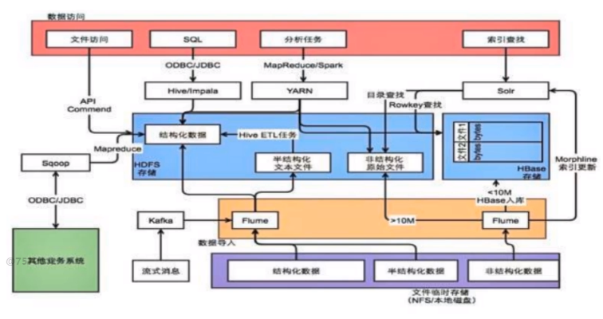
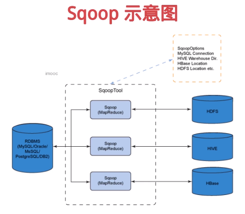
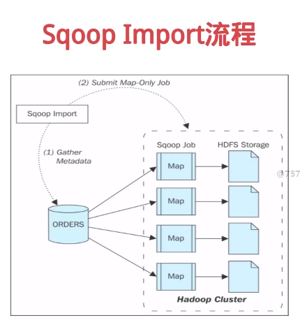
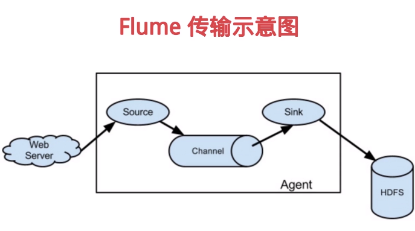
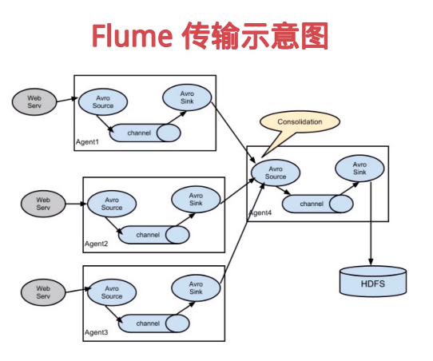
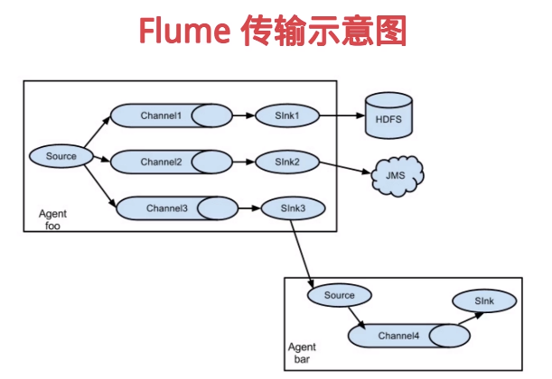
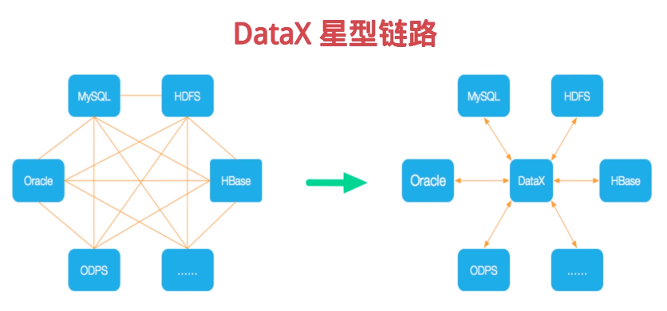
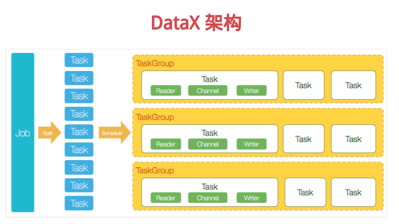

[TOC]

# 数据采集
ETL基本上就是数据采集的代表，包括数据的提取（Extract）、转换（Transform）和加载（Load）
数据源是整个大数据平台的上游，数据采集是数据源与数仓之间的管道
在采集过程中针对业务场景对数据进行治理，完成数据清洗工作

数据源复杂、多样，包括业务数据库、日志数据、图片、视频等多媒体数据等
数据采集形式也需要更加复杂，多样，包括定时、实时、增量、全量等

# 数据采集场景
场景1：从支持FTP、SFTP、HTTP等协议的数据源获取数据
场景2：从业务数据库获取数据，数据采集录入后需支撑业务系统
场景3：数据源通过kafka等消息队列，需要实时采集数据

# 数据采集系统需求
数据源管理与状态监控
定时、实时、全量、增量等多模式的数据采集及任务监控
元数据管理、数据补采及数据归档

# 常用数据采集框架
Sqoop：常用的关系数据库与HDFS之间的数据导入导出工具，将导入或导出命令翻译成MapReduce程序来实现
Apache Flume：分布式、可靠的、高可用的日志收集系统，支持多种数据来源，配置灵活
DataX：阿里开源的异构数据源同步工具，致力于实现关系数据库、HDFS、Hive、HBase、FTP等异构数据源的稳定数据同步

# Sqoop简介
用于在Hadoop和传统的数据库（Mysql、Postgresql等）进行数据的传递
可以通过Hadoop的MapReduce把数据从关系型数据库中导入到Hadoop集群
传输大量结构化或半结构化数据的过程是完全自动化的

Sqoop Import流程
获取源数据表的MetaData信息
根据参数提交MapReduce任务
表内每行作为一条记录，按计划进行数据导入

# Apache Flume
Flume是一个分布式的对海量日志进行采集，聚合和传输的系统
Flume系统分为三个组件，分别是source，sink，channel
Flume允许用户构建一个复杂的数据流，比如数据流经多个agent最终落地

# DataX简介
DataX是一个异构数据源离线同步工具
实现包括关系型数据库（MySQL、Oracle等）、HDFS、Hive、ODPS、HBase、FTP等各种异构数据源之间稳定高效的数据同步功能
将复杂的网状的同步链路变成了星型数据链路，有良好的扩展性

reader
writer