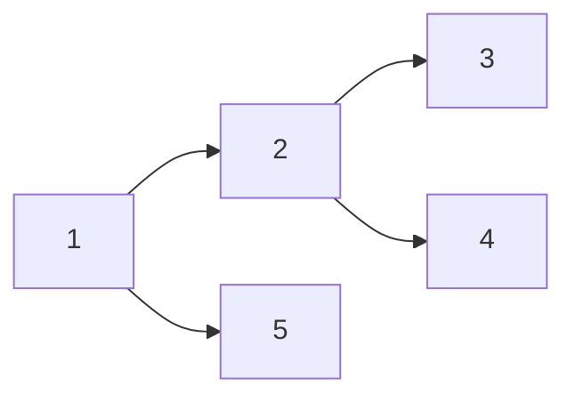
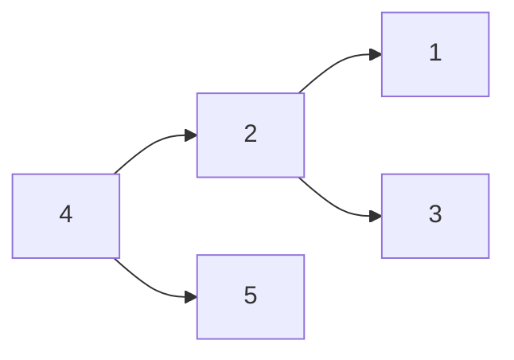
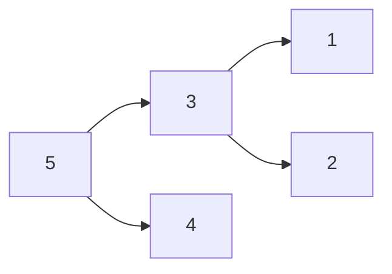

<!-- TOC -->

- [特征](#%E7%89%B9%E5%BE%81)
- [概念](#%E6%A6%82%E5%BF%B5)
- [深度优先遍历](#%E6%B7%B1%E5%BA%A6%E4%BC%98%E5%85%88%E9%81%8D%E5%8E%86)
    - [前序遍历](#%E5%89%8D%E5%BA%8F%E9%81%8D%E5%8E%86)
    - [中序遍历](#%E4%B8%AD%E5%BA%8F%E9%81%8D%E5%8E%86)
    - [后序遍历](#%E5%90%8E%E5%BA%8F%E9%81%8D%E5%8E%86)
- [广度优先遍历](#%E5%B9%BF%E5%BA%A6%E4%BC%98%E5%85%88%E9%81%8D%E5%8E%86)
- [二分搜索复杂度分析](#%E4%BA%8C%E5%88%86%E6%90%9C%E7%B4%A2%E5%A4%8D%E6%9D%82%E5%BA%A6%E5%88%86%E6%9E%90)

<!-- /TOC -->
# 特征
+ 查询、插入快O(log n)
+ 存在关键值，左右子节点与关键值存在比较关系
+ 非平衡
+ 基础元素二叉链表

# 概念
二分搜索树（英语：Binary Search Tree），也称为二叉搜索树、有序二叉树（ordered binary tree）或排序二叉树（sorted binary tree），是指一棵空树或者具有下列性质的二叉树：
+ 若任意节点的左子树不空，则左子树上所有节点的值均小于它的根节点的值；
+ 若任意节点的右子树不空，则右子树上所有节点的值均大于它的根节点的值；
+ 任意节点的左、右子树也分别为二叉查找树；

# 深度优先遍历
## 前序遍历

前序遍历首先访问根结点然后遍历左子树，最后遍历右子树。

## 中序遍历

中序遍历是二叉树遍历的一种，也叫做中根遍历、中序周游。在二叉树中，中序遍历首先遍历左子树，然后访问根结点，最后遍历右子树。

## 后序遍历

后序遍历（LRD）是二叉树遍历的一种，也叫做后根遍历、后序周游，可记做左右根。后序遍历有递归算法和非递归算法两种。在二叉树中，先左后右再根，即首先遍历左子树，然后遍历右子树，最后访问根结点。

# 广度优先遍历

# 二分搜索复杂度分析
总共有n个元素
+ 第1次折半：还剩n/2个元素
+ 第2次折半：还剩n/4个元素
+ 第3次折半：还剩n/8个元素
+ 第k次折半：还剩n/2^k个元素。最坏的情况下，最后还剩1个元素，令n/2^k = 1。得k=logn。

时间复杂度O(logn)，对折次数为树的高度O(h)

推算过程

第h层有多少个节点：
$n=2^{h-1}$

h层的树一共有多少个节点？
$n=2^0+2^1+2^2+\cdots+2^{h-1} = \frac{1*(1-2^h)}{1-2}=2^h-1$

复杂度推算：
$h=log2(n+1)=O(log2(n))=O(logn)$

