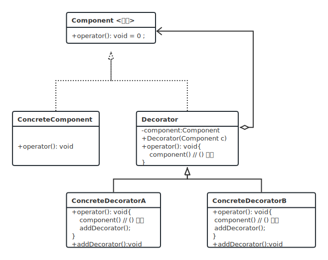

 亦称：装饰者模式、装饰器模式、Wrapper、Decorator 

 意图
 装饰模式是一种结构型设计模式， 允许你通过将对象放入包含行为的特殊封装对象中来为原对象绑定新的行为。 

 (通过组合封装扩展？)

装饰模式共分为四种角色：
Component（抽象构件）：具体构件与抽象装饰类的共同父类，声明具体结构中实现的业务方法，它的出现能够让客户端一致的通明对待装饰前和装饰后的类
ConcreteComponent（具体构件）：抽象构件的子类，实现具体的业务方法
Decorator（抽象装饰类）：抽象构件的子类，内部维持一个抽象构件的引用，通过该引用调用具体构件的业务方法
ConcreteDecorator（具体装饰类）：抽象装饰类的实现类，声明并实现各种装饰方法实现对具体构件的装饰

